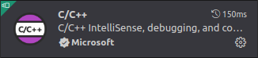
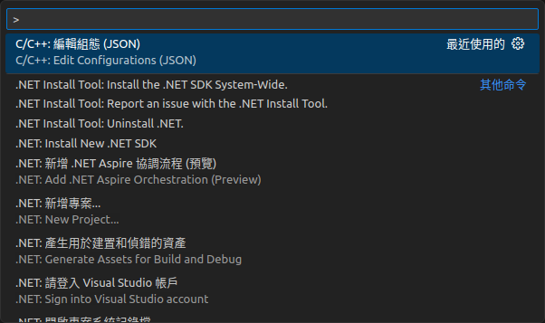

# 程式碼編輯環境

## Git Repository

依照官方網站使用指令 clone 下來的原始碼使用 submodule 管控各個模組，如果未來不考慮 PR，建議移除這些 submodule 關聯，將全部原始碼建立到同一個 Git 儲存庫會比較好管理修改的內容。

原始碼目錄結構如下：

```
ndnSIM
├── ns-3 // modified version of NS-3 for ndnSIM
│   └── src
│       └── ndnSIM
│           ├── NFD // submodule of ndnSIM
│           │   └── websocketpp // submodule of NFD
│           └── ndn-cxx // submodule of ndnSIM
└── pybindgen
```

應該不會動到 ns-3 的原始碼，ns-3 與 ndnSIM 之間也不存在 submodule 關聯。需要處理的是 ndnSIM 目錄中的關聯，<font color=red>從樹狀結構最尾端的 websocketpp 開始向上處理</font>，大概需要移除以下檔案／目錄：
* 必須刪除：
    * `.git`
    * `.gitmodules`
* 建議刪除
    * `.github`
    * `.travis.yml`
    * `.jenkins`
    * `.jenkins.d`
* 保留
    * `.gitignore`（不同模組忽略的檔案不盡相同）

如果要保留 submodule，請注意 ndnSIM 2.9 引用的模組版本為 :arrow_right: NFD version 22.02、:arrow_right: ndn-cxx version 0.8.0，使用 git clone --recursive 時就自動抓取這些版本。

## 程式編輯器

本篇論文在研究時，<font color=red>主要在 Ubuntu 上使用 Visual Studio Code 編輯程式碼</font>。此處參考下方文章設定 VS Code 以便閱讀、編輯程式碼。<font color=red>編譯部分由 ns-3 的 `waf` 處理</font>。
* ndnSIM学习（二）——配置VScode的跨文件转到定义 https://blog.csdn.net/MamiyaHasaki/article/details/120582082

### 設定 Go To Definition

1. 安裝擴充元件：C/C++<br/>


2. 用 VSCode 開啟 `ndnSIM` 目錄，點選 `ndnSIM` 下的 `.vscode` 目錄，以快捷鍵 `F1` 或 `Ctrl + Shift + P` 執行命令：C/C++: Edit Configuration (JSON)


3. 在 `.vscode` 目錄中會出現一個 `c_cpp_properties.json` 設定檔，裡面有預設值。將 `includePath` 設定值修改為 `~/ndnSIM/ns-3/build/**`。<br/>
```
{
    "configurations": [
        {
            "name": "Linux",
            "includePath": [
                "~/ndnSIM/ns-3/build/**"
            ],
            "defines": [],
            "compilerPath": "/usr/bin/gcc",
            "cStandard": "c17",
            "cppStandard": "gnu++14",
            "intelliSenseMode": "linux-gcc-x64"
        }
    ],
    "version": 4
}
```