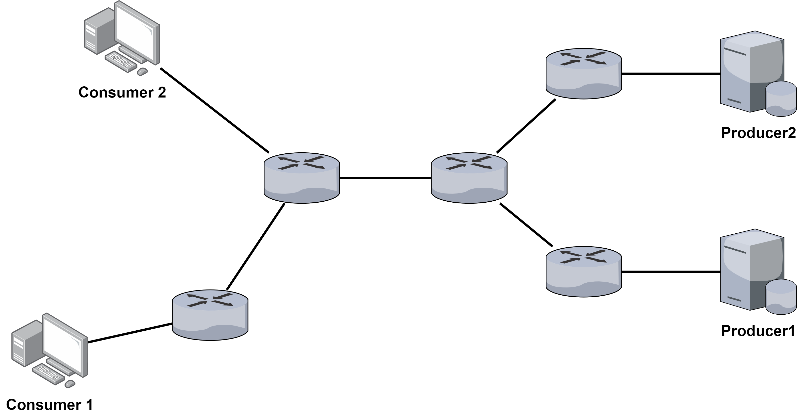
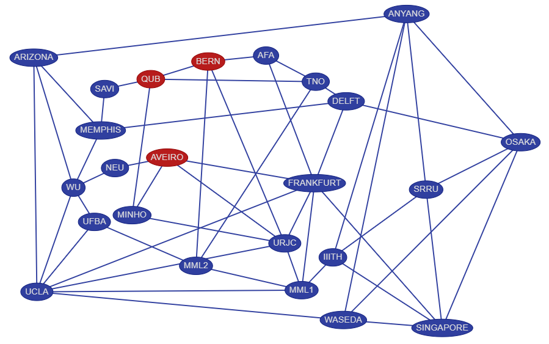

# 模擬方法與參數

## 說明

ndnSIM 以 scenario 設定不同模擬情境，撰寫 scenario 程式碼的基本方法請見官方文件，<font color=red>此處著重介紹如何使用《結合內容評分與共享機制的命名資料網路快取策略》的原始碼進行模擬，以及模擬時常用的設定、自定義的模擬參數</font>。

### 官方教學
* [https://ndnsim.net/current/examples.html](https://ndnsim.net/current/examples.html)
* 官方教學使用編譯時產生的範例進行說明。範例位置在 `/ndnSIM/ns-3/build/src/ndnSIM/examples`。

## 模擬

### 參數

#### 原有參數

* `--run`：執行模擬，後面附加 scenario，以下兩種方式都可以。
```
./waf --run=ndn-simple
```
```
./waf --run "ndn-simple"
```
* `--vis`：開啟 visualizer。
```
./waf --run=ndn-simple --vis
```

#### 自訂參數

##### 指令

* 使用者可以為每個 scenario 自訂參數，目前研究實驗用的 scenario 都在指令中加入了以下參數。
* 參數說明：
    * `--result=1`: 不執行模擬，輸出最後一次模擬結果。
    * `--cs-size=x`: content store 容量。
    * `--frequency=x`: 封包發送頻率。
    * `--s=x`: s of Zipf-Mandelbrot。
    * `--q=x`: q of Zipf-Mandelbrot。
    * `--content=x`: number of contents。
    * `--policy=x`: x=lru, lru-vicinity, scoring, scoring-vicinity。
    * `--sim-time=x`: 模擬時間。
* 使用範例：
```
./waf --run "test-ndn-testbed --cs-size=20 --sim-time=20.0"
```

##### test-config

使用 `test-config.txt` 修改模擬設定更方便。

* 檔案位置：`/ndnSIM/ns-3/build/src/ndnSIM/examples/test-config.txt`
* 參數說明：
    * `cs-size`: 同[指令](#_8)說明。
    * `frequency`: 同[指令](#_8)說明。
    * `s`: 同[指令](#_8)說明。
    * `q`: 同[指令](#_8)說明。
    * `content`: 同[指令](#_8)說明。
    * `policy`: 同[指令](#_8)說明。
    * `sim-time`: 同[指令](#_8)說明。
    * `rand-seed`: 只用於 `test-ndn-testbed`，隨機選擇生產者節點的亂數種子。
    * `producer-num`: 只用於 `test-ndn-testbed`，設定拓樸中的生產者節點數量。
* 範例：
```
cs-size=25
frequency=10
s=1.2
q=0.7
content=250
policy=lru
sim-time=200.0
rand-seed=1423
producer-num=5
```

### scenario & topology

#### 存放位置

用於研究模擬實驗的檔案都放在：

* scenario：`ndnSIM/ns-3/src/ndnSIM/examples`
* topology：`ndnSIM/ns-3/src/ndnSIM/examples/topologies`

#### scenario 對應的 topology

* `test-inline.cpp` 搭配 `topo-6-node-in-line.txt`

{ width="60%" }

* `test-multi-src.cpp` 搭配 `topo-3-source.txt`

{ width="60%" }

* `test-multi-src-dst.cpp` 搭配 `topo-multi-src-and-dst.txt`

{ width="60%" }

* `test-ndn-testbed.cpp` 搭配 `topo-ndn-testbed-ndnsim.txt`

{ width="60%" }


### 取得 topology

ndnSIM 提供的範例同時包含網路拓樸（topology）檔，但使用文字檔憑空撰寫自己網路拓樸很不現實，可行的方法有三種：

1. 別人提供的檔案
2. ns-3 或 ndnSIM 都能搭配 Brite 產生網路拓樸，此方法須自行研究。
3. ndnsim-topology generator 提供的視覺化工具產生網路拓樸。
    * GitHub repository: [github.com/SunnyQjm/ndnsim-topology](https://github.com/SunnyQjm/ndnsim-topology)
    * Website: [sunnyqjm.github.io/ndnsim-topology/](https://sunnyqjm.github.io/ndnsim-topology/)

### 錯誤訊息

使用 `--vis` 模擬時看到以下兩行錯誤訊息不用擔心。`kiwi.ui` 和 `icon applets-screenshooter` 不影響模擬結果，且通常不會使用 visualizer 查看模擬結果，整體而言沒有影響。

```
Could not load plugin 'show_last_packets.py': No module named 'kiwi.ui'
```

* 沒有 `kiwi` 只會讓 visualizer 缺少一些外掛。[^1]
* 無害的警告，可以忽略。[^2]

```
Could not load icon applets-screenshooter due to missing gnomedesktop Python module
```

* 只會在 UI 的 title bar 缺少 icon。[^3]

[^1]: [No module named 'kiwi.ui' · Issue #105 · named-data-ndnSIM/ndnSIM](https://github.com/named-data-ndnSIM/ndnSIM/issues/105). GitHub.
[^2]: [Could not load plugin 'show_last_packets.py': No module named 'kiwi.ui'](https://groups.google.com/g/ns-3-users/c/vkqPyJmxvYU/m/744RzpPfCQAJ). ns-3-users - Google 網路論壇.
[^3]: [[ndnSIM] missing gnomedesktop Python module](https://www.lists.cs.ucla.edu/pipermail/ndnsim/2018-April/004641.html). ndnSIM mailing list.