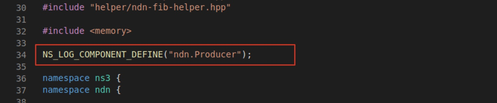

## 說明

使用 ndnSIM 時會用到的 Log 操作。

## 終端機使用

使用 Debug 模式編譯，就能在模擬時輸出 Log 到終端機。

* 輸出所有 Log

```
NS_LOG=* ./waf --run=<scenario name>
```

### 指定輸出 Log 的組件

* 例如，只輸出 Producer 和 Consumer 的 Log，並且只能使用完整組件名稱，除了 `NS_LOG=*`，沒有 * 這種萬用符號可以使用。

```
NS_LOG=ndn.Producer:ndn.Consumer ./waf --run=<scenario name>
```

* 可以先定義 Log 輸出規則，以後每次執行 `./waf --run` 時就不用定義規則。

```
export NS_LOG=ndn.Consumer:ndn.Producer:ndn-cxx.nfd.Forwarder \\ 指定類別
./waf --run=<scenario name> \\ 執行模擬時只要指定 scenario
```

* 將 Log 輸出到檔案
```
./waf --run ndn-simple>out.log 2>&1
```

* 同時輸出 Log 到終端機與檔案
```
./waf --run=test-simple 2>&1 | tee out.log
```

### 指定 Log 輸出級別

* `NS_LOG` 可以指定輸出的 Log 層級，例如 `NS_LOG=ndn.Producer="info"` 表示輸出 `Producer` 組件中層級為 `INFO` 的 Log。
    * 只有指定層級可以不使用 `"` 包裹 info，但對同個組件有多項指定時必須使用 `"` 包裹 token。
* `NS_LOG=ndn.Producer="info"` 與 `NS_LOG=ndn.Producer="level_info"` 意義不同。
    * `NS_LOG=ndn.Producer="info"`：只輸出 `INFO` 層級。
    * `NS_LOG=ndn.Producer="level_info"`：輸出 `INFO` 及其上層級。
* Log 層級請參考 ns-3 的 [Severity and Level Options](https://www.nsnam.org/docs/release/3.22/manual/html/logging.html#severity-and-level-options)。

### 指定 Log 輸出格式

* 若只有指定層級，最後輸出的 Log 格式會缺少時間、節點等資訊，使用 Prefix 可以手動設定產生這些資訊。
* `NS_LOG="*=all|prefix_level"` 就會得到輸出層級和訊息的 Log。
* Prefix 選項請參考 ns-3 的 [Severity Prefix](https://www.nsnam.org/docs/release/3.22/manual/html/logging.html#severity-prefix)。
* 結合層級與 Prefix 的範例：
```
// 只輸出 INFO 層級，並輸出所有 Prefix
NS_LOG=ndn.Producer="info|prefix_all":ndn.ConsumerZipfMandelbrot="info|prefix_all"
```

### 常用輸出規則設定

* 指定輸出 Log 的組件，輸出所有 Prefix 以取得時間、節點等資訊，只輸出層級為 Info 的 Log。

```
export NS_LOG=ndn.Producer="info|prefix_all":ndn.ConsumerZipfMandelbrot="info|prefix_all":ndn-cxx.nfd.Forwarder="info|prefix_all":ndn-cxx.nfd.ContentStore="info|prefix_all":ndn-cxx.nfd.ScoringTable="info|prefix_all"
```

* 只有指定輸出 Log 的組件，因此 DEBUG 層級的資訊都會輸出，Log 量較大。

```
export NS_LOG=ndn.Producer:ndn.ConsumerZipfMandelbrot:ndn-cxx.nfd.Forwarder:ndn-cxx.nfd.ContentStore:ndn-cxx.nfd.ScoringTable
```

## 程式中使用

### 輸出資訊

* 在程式碼中直接使用 `NS_LOG_` 或 `NFD_LOG_` 輸出，<font color=red>在執行模擬器前設定好 `NS_LOG=` 輸出層級</font>，就會輸出對應 Log 到終端機。
    * 例如：`NS_LOG_DEBUG("message")`、`NFD_LOG_DEBUG("message")`。
    * 在 ns-3 專案下要使用 `NS_LOG_`， NFD 專案下要使用 `NFD_LOG_`。
    * Log 層級：`NS_LOG_INFO`, `NS_LOG_DEBUG`, `NS_LOG_WARN`, `NS_LOG_ERROR`
* `NS_LOG_UNCOND()`、`NFD_LOG_UNCOND()` 不受 `NS_LOG=` 設定層級影響，就像使用 `printf` 或 `cout`。
    * 單純輸出 Log，不會寫明從哪個組件產生，不適合用於追蹤。
    * 如果有註冊 LogComponent，就應該用 `NS_LOG_XXX()` 或 `NS_LOG_XXX()`。

### 註冊 LogComponent

`NS_LOG=` 可以選擇的組件必須在程式碼中註冊過 LogComponent，只需要在 `.cpp` 放置一行 `NS_LOG_COMPONENT_DEFINE("ComponetName")` 即可。下圖是 `ndn-producer.cpp` 中的定義：



如果自訂一個新的 producer 為 ndn.MyProducer，在 `ndn-my-producer.cpp` 定義組件名稱為 `NS_LOG_COMPONENT_DEFINE("ndn.MyProducer")`，就能在 `NS_LOG=` 指定這個組件名稱。