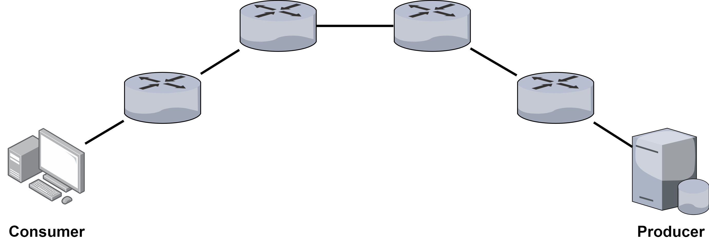
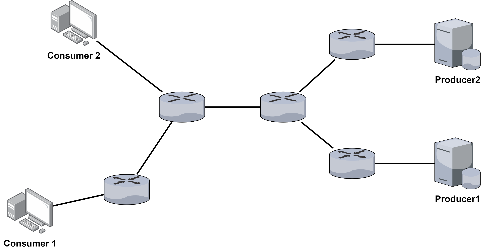
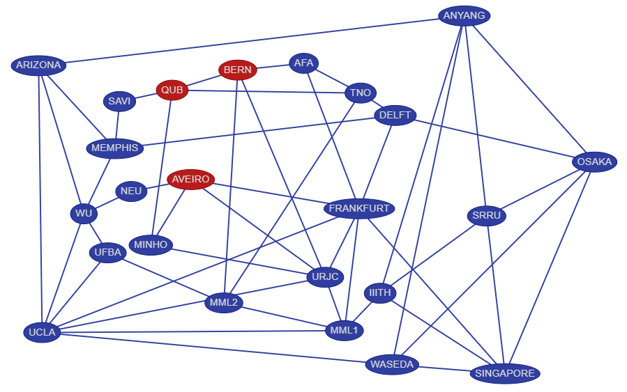

## 說明

《結合內容評分與共享機制的命名資料網路快取策略》使用四種 topology 進行實驗，實驗設定見論文敘述。

## 實驗數據目錄結構

```
experiment-results
├── inline
│   ├── content
│   ├── cs-size
│   ├── frequency
│   └── s
├── multi-src
│   └── 子目錄結構同上
├── multi-src-dst
│   └── 子目錄結構同上
└── ndn-testbed
    └── 子目錄結構同上
```

### 實驗拓樸

實驗數據中的目錄與 topology 的對應如下：

* `inline`

{ width="60%" }

* `multi-src`

{ width="60%" }

* `multi-src-dst`

{ width="60%" }

* `ndn-testbed`

{ width="60%" }

### 實驗類型

四種參數變化各自使用一個目錄存放實驗數據。變化參數如下：

* `content`：Number of Contents，內容總數
* `cs-size`：Content Store 容量
* `frequency`：請求頻率
* `s`：Zipf-Mandelbrot 參數 s

實驗數據存放於 `csv` 檔，例如 `avg_delay-time.csv` 彙整實驗產生的資料平均取得時間，再經由 python 腳本取得對應圖表。

### 圖表

目錄中每個 python 腳本將一種參數變化的實驗數據轉換為圖表。